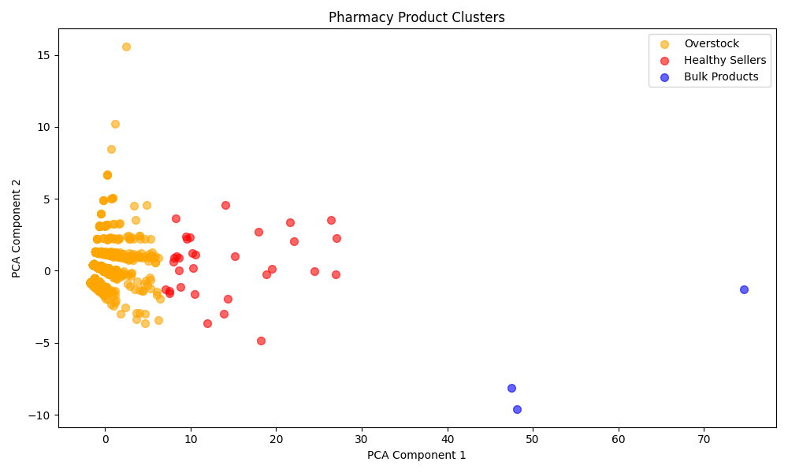
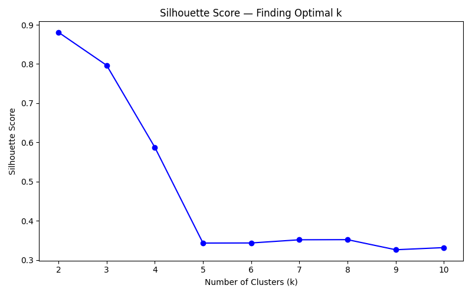

# Pharmacy Inventory Analysis
An end-to-end machine learning project that segments real world pharmacy products into behavioral clusters to identify overstock and healthy inventory — then builds a classifier to predict inventory behavior for new products. Built to prevent medication expiration and reduce waste in a real community pharmacy.

# Background:
I am a pharmacist working in a community pharmacy, currently studying Health Informatics with a focus on AI and Data Science. This is my first machine learning project — built both to learn data science fundamentals and to solve a real problem I face daily at work:
Which products are overstocked and not moving, and what should I do about them?

# Business Problem:
Community pharmacies face a constant challenge with inventory management:
Overstocked products expire before they sell → financial loss
Some products sell better in other pharmacies → can be redistributed
Manual tracking across hundreds of products is inefficient
This project uses KMeans clustering to automatically segment 1188 pharmacy products into actionable groups.

# Dataset:
- **Source:** Real pharmacy inventory data (de-identified)
- **Original size:** 1,410 products
- **After cleaning:** 1,188 active products
- **Features used:** Sales velocity, overstock ratio, days of supply, sell-through rate, return rate, price per item, product type
 
> Raw data is not shared for privacy reasons. A de-identified sample is provided in `sample_clusterd.csv`
### Pipeline
```
Raw Data (3 product types: OTC, ACT, CHR)
    ↓
01_load_and_merge.py               → Load and merge inventory + sales files
02_preprocessing.py                → Fix data types, handle nulls
03_combine_and_engineer.py         → Combine files, engineer return features
04_clustering_preprocessing.py    → Calculate Sell Through Rate, Overstock Ratio,
                                     Days of Supply, handle outliers, encode product type
05_clustering_model.py             → Scale features, find optimal k
06_train_and_label.py              → Train KMeans, assign business labels
07_evaluation_and_visualization.py → PCA plot, Silhouette Score
```
 
### Key Engineering Decisions
- Used **RobustScaler** instead of StandardScaler — data has significant outliers
- Replaced `inf` values with `max * 2` to penalize extreme overstock products
- Dropped inactive products (zero sales AND zero returns) before clustering
- Chose **k=3** based on Silhouette Score (0.79) and business interpretability
 
### Cluster Results
 
| Cluster | Label | Description | Action |
|---|---|---|---|
| 0 | Overstock | Barely selling — at this rate will take 5+ years to sell all stock | Discount, redistribute, stop reordering |
| 1 | Good Sellers | Selling well, healthy inventory, no action needed | Maintain current strategy |
| 2 | Bulk Products | High sales volume, bought in large quantities — needs monitoring | Watch carefully to avoid over-ordering |
 
### Clustering Evaluation
 
| Metric | Value | Interpretation |
|---|---|---|
| Silhouette Score | 0.7966 | Strong cluster separation|
| PCA Variance Explained | 92.0% | Most information preserved|
| Visual Separation | Clear | Clusters are real and distinct|
 
### PCA Cluster Visualization

 
### Elbow Method

 
### Silhouette Score

 
---
 
## Part 2 — Classification
 
Using cluster labels as the target variable, a classifier was built to predict which inventory group a new product belongs to — without needing to run the full clustering pipeline again.
 
### Pipeline
```
clustered_data.csv + overstock_files.csv
    ↓
01_classification_preprocessing.py → merge raw + clustered data, engineer features
02_split_scale_balance.py          → train/val/test split + RobustScaler + SMOTE
03_logistic_regression.py          → baseline model with regularization (C=0.1)
04_random_forest.py                → main model + feature importance analysis
```
 
### Key Decisions
- Used **3-way split** (60% train / 20% val / 20% test) with stratification
- Applied **SMOTE** on training data only to handle class imbalance
- Used `k_neighbors=1` in SMOTE — Bulk Products has only 2 training samples
- Added **C=0.1 regularization** to Logistic Regression to prevent overfitting
 
### Classification Results
 
| Model | Train Acc | Val Acc | CV Mean F1 | CV Std |
|---|---|---|---|---|
| Logistic Regression | 99.86% | 99.58% | 99.71% | 0.0028 |
| Random Forest | 99.90% | 99.58% | 99.81% | 0.0018 |
 
> **Recommended model:** Logistic Regression — higher recall for Healthy products (1.00 vs 0.88). Missing a healthy product is more costly than a false alarm.
 
> **Note:** High accuracy reflects naturally well-separated cluster distributions. The primary value of this project lies in the unsupervised clustering pipeline.
 
### Feature Importance (Random Forest)
 
| Feature | Importance |
|---|---|
| Sum of MAX | 31.5% |
| Total Sold Q 180d | 25.1% |
| Sum of Total available | 22.4% |
| Return Rate 180d | 12.1% |
| Price per Item | 5.3% |
| Product Type | 3.7% |
 
### Known Limitations
- Bulk Products class has only 3 real samples → SMOTE creates mostly synthetic data
- Bulk Products not represented in test set due to extreme class imbalance
- Future work: collect data from multiple pharmacy branches to improve minority class
 
---
 
## Tech Stack
 
| Tool | Usage |
|---|---|
| Python 3.12 | Core language |
| pandas | Data wrangling |
| numpy | Numerical operations |
| scikit-learn | Scaling, KMeans, PCA, classification, evaluation |
| imbalanced-learn | SMOTE for class imbalance |
| matplotlib | Visualization |
| seaborn | Statistical plots |
| joblib | Model saving |
 
---
 
## File Structure
 
```
pharmacy-inventory-analysis/
├── README.md
├── sample_clusterd.csv
├── clustering/
│   ├── 01_load_and_merge.py
│   ├── 02_preprocessing.py
│   ├── 03_combine_and_engineer.py
│   ├── 04_clustering_preprocessing.py
│   ├── 05_clustering_model.py
│   ├── 06_train_and_label.py
│   ├── 07_evaluation_and_visualization.py
│   ├── elbow_plot.png
│   ├── pca_clusters.png
│   └── silhouette_plot.png
└── classification/
    ├── 01_classification_preprocessing.py
    ├── 02_split_scale_balance.py
    ├── 03_logistic_regression.py
    └── 04_random_forest.py
```
 
---
 
## What's Next
 
- [ ] Build an interactive dashboard to present results visually
- [ ] Automate reorder recommendations based on cluster assignment
- [ ] Collect data from multiple pharmacy branches to improve Bulk Products classification

## Author
 
**Norah Nasser**
Pharmacist | Health Informatics Master Student | Healthcare Data Scientist
 
[](https://www.linkedin.com/in/norah-altuwayli-432922167)

